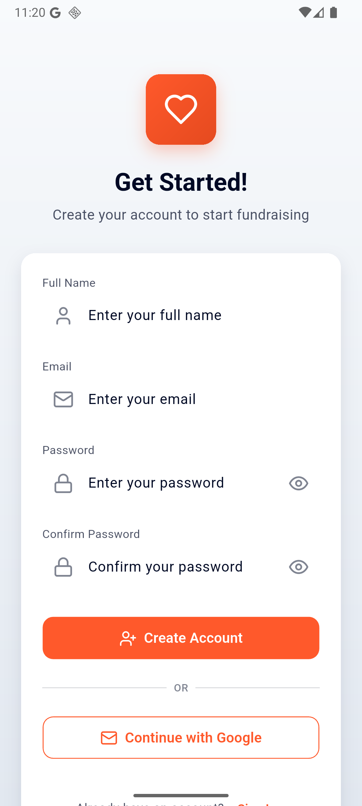
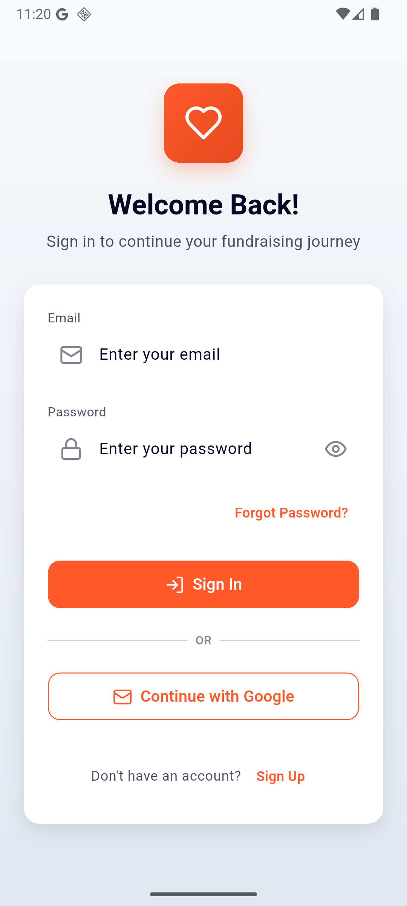
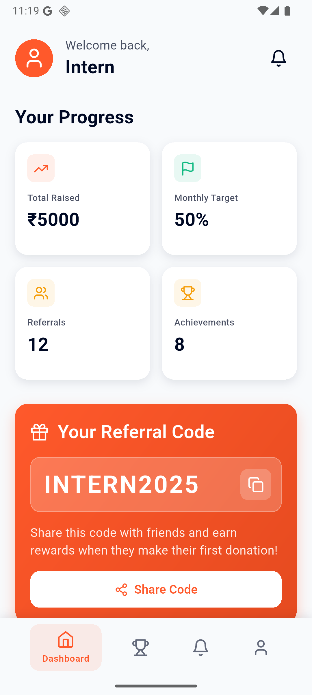
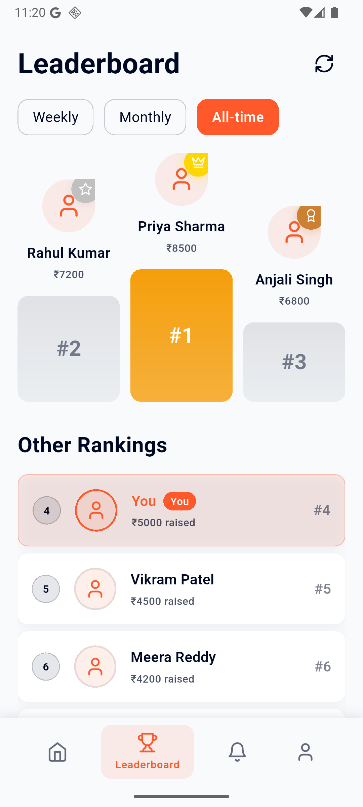
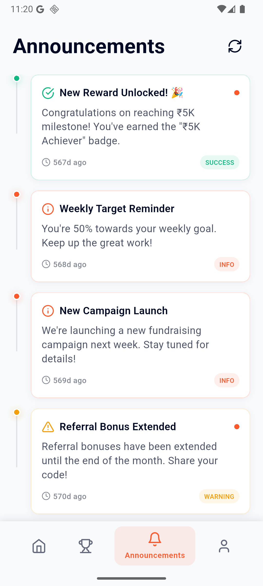
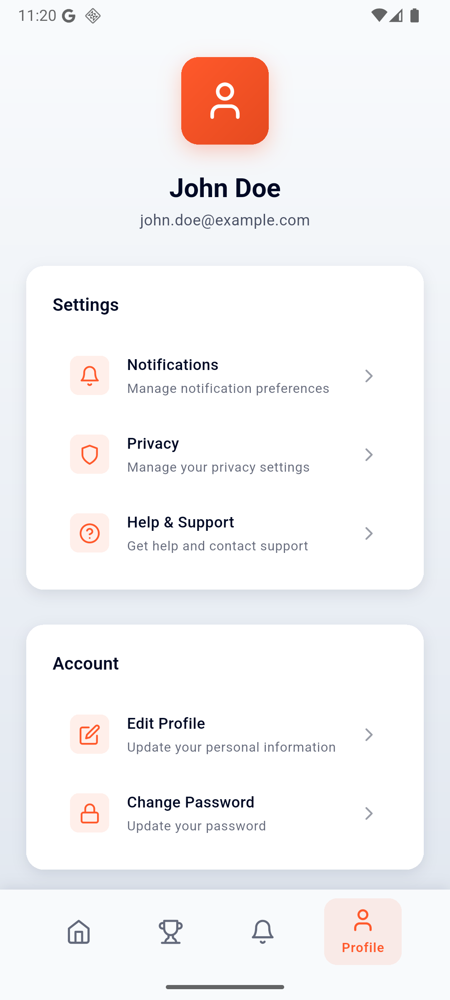

# Intern Dashboard - She Can Foundation

A modern Flutter app for fundraising interns to track donations, referrals, and view leaderboards.

## 📱 Screenshots

<div align="left">

### Signup Screen


### Login Screen


### Dashboard



### Leaderboard


### Announcements


### Profile


</div>

## 🛠 Tech Stack

- Flutter
- Riverpod (State Management)
- Go Router (Navigation)
- Material 3 Design

## 📁 Project Structure

```
lib/
├── app/                          # App-level configuration
│   ├── app.dart                  # Main app widget
│   ├── router.dart               # Route definitions
│   └── theme/                    # App theming
│       ├── app_theme.dart
│       ├── colors.dart
│       ├── dimensions.dart
│       └── typography.dart
├── core/                         # Core utilities and shared components
│   ├── constants/                # App constants and mock data
│   │   ├── app_constants.dart
│   │   └── mock_data.dart
│   ├── models/                   # Data models
│   │   ├── announcement_model.dart
│   │   ├── donation_model.dart
│   │   ├── leaderboard_model.dart
│   │   └── user_model.dart
│   ├── utils/                    # Utility functions
│   │   ├── extensions.dart
│   │   ├── formatters.dart
│   │   └── validators.dart
│   └── widgets/                  # Shared widgets
│       ├── animated_card.dart
│       ├── custom_button.dart
│       ├── custom_text_field.dart
│       ├── loading_widget.dart
│       ├── referral_code_card.dart
│       └── stats_card.dart
├── features/                     # Feature-based modules
│   ├── announcements/            # Announcements feature
│   │   ├── pages/
│   │   │   └── announcements_page.dart
│   │   ├── providers/
│   │   │   └── announcements_provider.dart
│   │   └── widgets/
│   │       └── announcement_card.dart
│   ├── auth/                     # Authentication feature
│   │   ├── pages/
│   │   │   ├── login_page.dart
│   │   │   └── signup_page.dart
│   │   ├── providers/
│   │   │   └── auth_provider.dart
│   │   └── widgets/
│   │       └── auth_form.dart
│   ├── dashboard/                # Dashboard feature
│   │   ├── pages/
│   │   │   └── dashboard_page.dart
│   │   ├── providers/
│   │   │   └── dashboard_provider.dart
│   │   └── widgets/
│   │       ├── referral_code_card.dart
│   │       ├── rewards_section.dart
│   │       └── stats_card.dart
│   ├── leaderboard/              # Leaderboard feature
│   │   ├── pages/
│   │   │   └── leaderboard_page.dart
│   │   ├── providers/
│   │   │   └── leaderboard_provider.dart
│   │   └── widgets/
│   │       ├── leaderboard_item.dart
│   │       └── rank_badge.dart
│   └── profile/                  # Profile feature
│       └── pages/
│           └── profile_page.dart
├── shared/                       # Shared components and layouts
│   ├── layouts/
│   │   └── main_layout.dart
│   ├── navigation/
│   │   └── bottom_nav_bar.dart
│   ├── providers/
│   │   └── splash_provider.dart
│   └── widgets/
│       └── splash_screen.dart
└── main.dart                     # App entry point
```